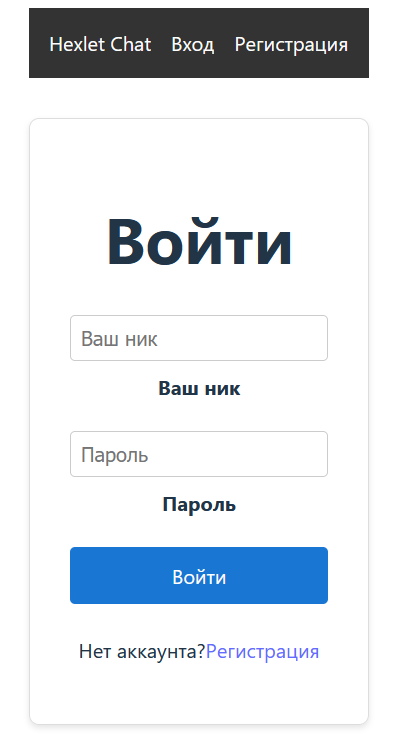
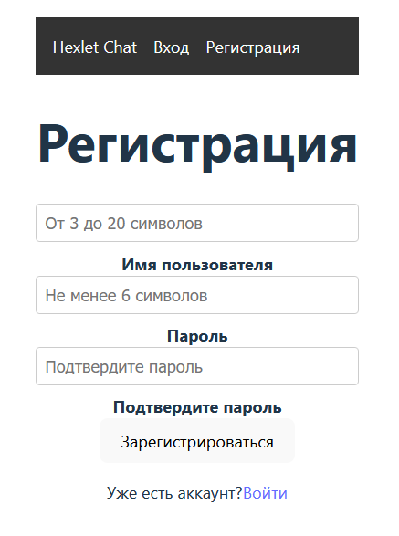
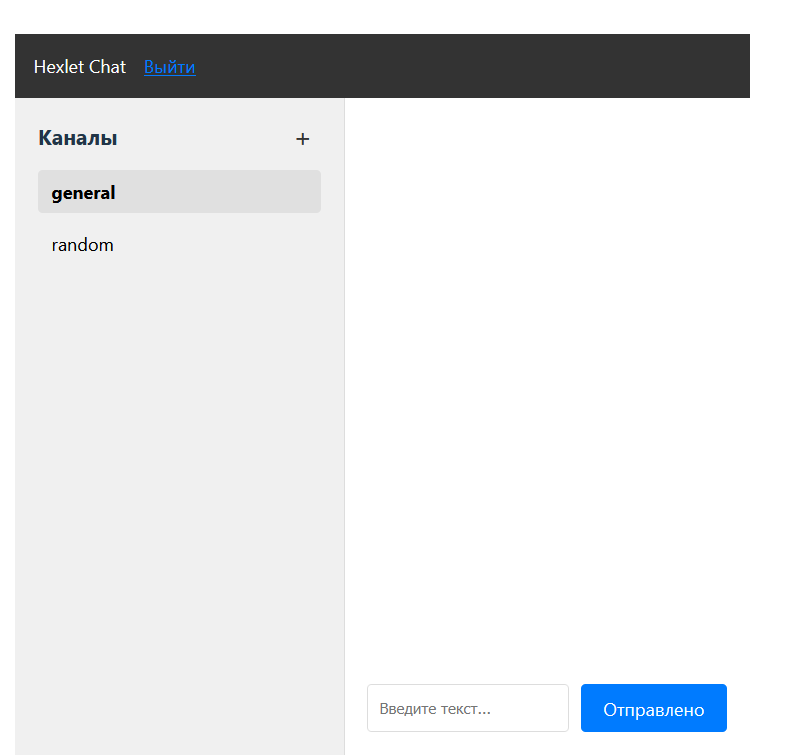
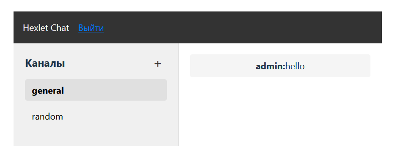
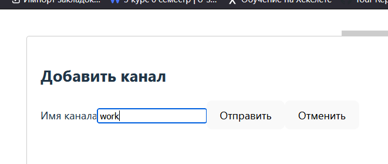
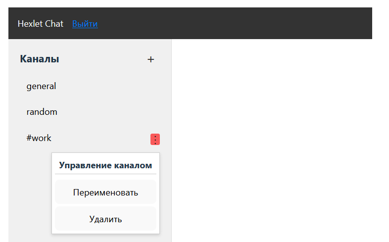

# Проект "Hexlet-Chat"
***

### Hexlet tests and linter status:
[](https://github.com/VladyBarvy/frontend-project-12/actions)
***

Проект "Hexlet-Chat" - это самостоятельная работа в рамках летней учебной практики 3 курса.
Исходное задание:
<https://ru.hexlet.io/programs/frontend/projects/12>

# Стек технологий
- React + Vite
- Javascript
- CSS
- WebSocket
***

# Запуск
- склонировать репозиторий
```
git clone git@github.com:VladyBarvy/frontend-project-12.git
```
- перейти в директорию проекта
```
cd frontend-project-12
```
- установить зависимости
```
make install
```
- выполнить сборку приложения
```
make build
```
- запустить приложение
```
make start
```
- открыть приложение в браузере по адресу
```
http://127.0.0.1:5001/
```
- для локального тестирования функционала приложения рекомендуется открыть приложение в двух разных браузерах. Так можно сымитировать обмен сообщениями между двуми пользователями
- в качестве тестового пользователя можно либо зарегистрировать нового, либо воспользоваться резервным
```
 Логин: admin
Пароль: admin
```
***

# Описание проекта
- Авторизация
<div align="center">

</div>
---
- Регистрация
<div align="center">

</div>
---
- Основное окно чата
<div align="center">

</div>
---
- Отправка сообщения
<div align="center">

</div>
---
- Добавление нового канала
<div align="center">

</div>
---
- Меню управления новым каналом
<div align="center">

</div>
---